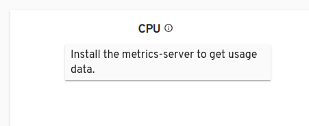

Metrics server helps us get resource usage data for our clusters and 
if we don't have it installed for our cluster than we show a notice on headlamp
about it as shown below: 

To Read more about metrics server visit [metrics-server](https://kubernetes.io/docs/tasks/debug-application-cluster/resource-metrics-pipeline/#metrics-server)

Also checkout how to configure metrics server settings for minikube here [hello-minikube](https://kubernetes.io/docs/tutorials/hello-minikube/)

